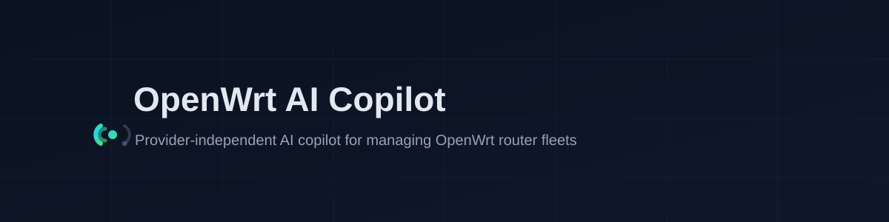
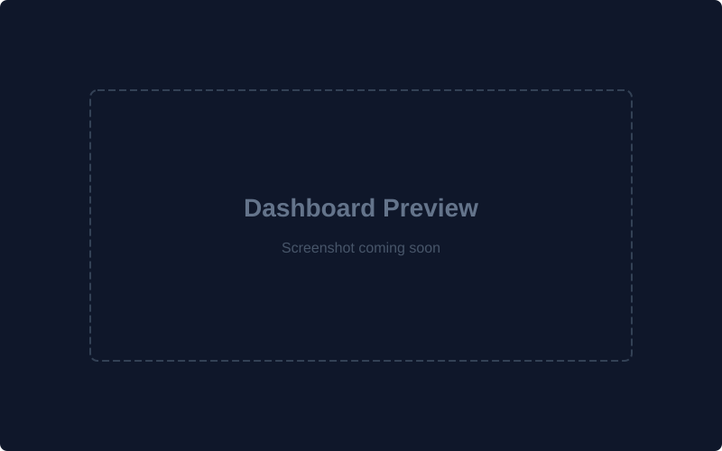
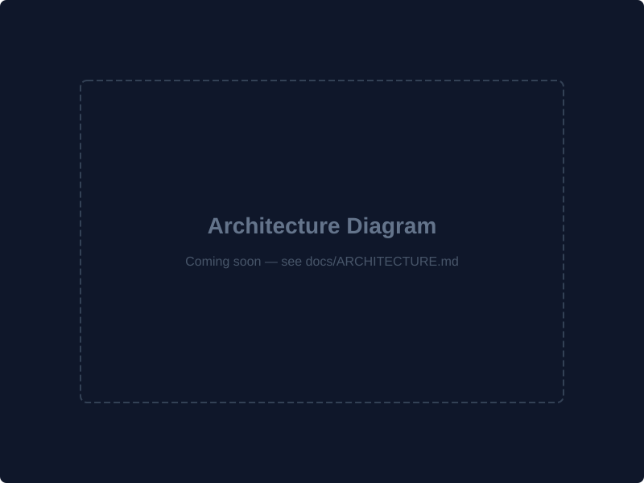

# OpenWrt AI Copilot

<p align="center">
  
</p>

<p align="center">
  <a href="https://opensource.org/licenses/MIT"></a>
  
  
  <a href="https://nextjs.org"></a>
  <a href="https://fastapi.tiangolo.com"></a>
  <a href="https://github.com/necrodin/openwrt-ai-copilot"></a>
</p>

A production-grade, provider-independent AI copilot for managing OpenWrt router
fleets. Ask questions about your network in natural language, diagnose
connectivity issues, and — under strict human approval — propose and apply
validated configuration changes.

**The AI layer is fully provider-independent.** Supported providers (Ollama,
NVIDIA NIM, OpenAI, OpenRouter, LM Studio, vLLM) are interchangeable adapters,
never hard dependencies. Swapping Ollama for OpenAI is a config change, not a
code change.

## Screenshots

<p align="center">
  
</p>

> Screenshots are placeholders and will be replaced as the UI stabilizes.

## Architecture

<p align="center">
  
</p>

> The full architecture is documented in [docs/ARCHITECTURE.md](docs/ARCHITECTURE.md).

## What's in v1.0

- **Router Agent** (`router-agent/`) — a data-collection daemon that reads live
  router state over SSH (via `ubus`/`UCI`), LuCI JSON-RPC, or a local collector.
  Each collector reports independently; a failed collector never aborts the pass.
- **Live dashboard** — a WebSocket-driven view of router state (system, CPU,
  memory, storage, network interfaces) at `/dashboard`.
- **Router-aware AI chat** — at `/chat`. Every turn is grounded in the latest
  router snapshot (never invented), with automatic intent detection
  (`system`, `cpu`, `memory`, `storage`, `network`), tool-backed answers,
  streaming, chat history, and Markdown rendering.
- **Diagnosis & recommendations** — deterministic engines that flag issues
  (e.g. missing WAN, high load, memory pressure, reboots) and propose
  remediation, served with the router status.
- **Embedding platform** — provider-independent `EmbeddingFactory` with
  batching, retries, timeouts, and token-usage accounting.
- **Vector database layer** — four interchangeable backends behind one
  interface: SQLite (offline reference), Chroma, Qdrant, FAISS.
- **Knowledge platform** — `source → loader → parser → extractor → chunker →
  indexer` ingestion for Markdown, HTML, PDF, TXT, JSON, YAML, and XML.
- **Retrieval (RAG)** — retrieval core + `rag.ai` integration: embed → retrieve
  → rerank → ground → answer with citations and conversation memory.
- **Provider administration API** — list providers, probe health, detect
  capabilities, read token usage, list models.

## Technology stack

| Layer | Technology |
|---|---|
| Frontend | Next.js 15, React 19, TypeScript, Tailwind CSS v4, shadcn/ui |
| Backend | FastAPI, Python 3.12+ |
| Database | SQLite (via SQLAlchemy 2) |
| AI layer | Provider-agnostic Python packages (`ai`, `providers`, `rag`, `vision`, `vectorstore`, `knowledge`) |
| Router data | `router-agent` over SSH / LuCI JSON-RPC / local |
| Deployment | Docker, Docker Compose |

## Repository layout

```
openwrt-ai/
├── frontend/          Next.js web UI (home, live dashboard, AI chat)
├── backend/           FastAPI control plane (app package)
├── ai/                Provider-agnostic AI core: protocols, models, registry
├── providers/         Provider adapters (ollama, nim, openai, openrouter, lmstudio, vllm, nvembed)
├── rag/               Retrieval core (retriever, context, prompt, memory, tokens, cache, rerank, rag.ai)
├── vision/            Vision abstraction (multimodal chat re-exports)
├── vectorstore/       Provider-independent vector DB layer (sqlite, qdrant, chroma, faiss)
├── knowledge/         Provider-independent knowledge platform (sources, parsers, chunkers, indexers)
├── database/          SQLite schema, engine, session helpers
├── router-agent/      On-device agent (data collection over SSH / ubus / LuCI)
├── docker/            Docker Compose topologies
├── tests/             Unit + e2e integration tests (pytest)
└── docs/              Architecture + sprint documentation
```

## Quickstart

### 1. Backend (Python 3.12+)

```bash
make install          # create .venv, install all python packages, npm install
make dev-backend      # uvicorn on http://localhost:8000
```

Verify: `curl http://localhost:8000/api/health`

### 2. Frontend

```bash
make dev-frontend     # Next.js dev server on http://localhost:3000
```

The frontend proxies `/api/*` to the backend (default `http://localhost:8000`).
The live dashboard is at `/dashboard`; the AI chat is at `/chat`.

### 3. Tests & linting

```bash
make test             # pytest (tests/)
make lint             # ruff check + format
make format           # ruff format
```

The e2e suite (`tests/e2e/test_router_pipeline.py`) exercises the full router
pipeline — intent detection, tool execution, diagnosis, recommendations, RAG
grounding, and caching — with a mocked AI transport.

### 4. Docker (full stack)

```bash
docker compose -f docker/docker-compose.yml up --build
```

- Frontend: http://localhost:3000
- Backend API docs: http://localhost:8000/api/docs

## Public API (prefix `/api`)

| Endpoint | Description |
|---|---|
| `GET /health` | Liveness probe (`status`, `service`, `version`, `environment`) |
| `GET /ready` | Readiness probe |
| `GET /router/status` | Merged router status: connection state + snapshot + diagnosis + recommendations |
| `GET /router/info` | Router identity (hostname, model, board, firmware, kernel, uptime) |
| `GET /router/context` | Structured router context used to ground chat answers |
| `GET /dashboard/latest` | Latest dashboard update (`DashboardUpdate`) |
| `WS /dashboard/ws` | Live dashboard push |
| `POST /chat` | Non-streaming chat reply (`{session_id, message, provider?, model?}`) |
| `POST /chat/stream` | Streaming reply over Server-Sent Events (`delta` / `done` / `error`) |
| `GET /chat/history` | Persisted turns for a session (`?session_id=`) |
| `GET /chat/sessions` | Known sessions, newest first |
| `GET /providers` | Configured providers with static capability summary |
| `GET /providers/{name}` | Single provider summary |
| `GET /providers/{name}/health` | Provider reachability probe |
| `GET /providers/{name}/capabilities` | Detected capabilities |
| `GET /providers/{name}/usage` | Cumulative token-usage counters |
| `GET /providers/{name}/models` | Models the provider serves |

## Documentation

- [docs/ARCHITECTURE.md](docs/ARCHITECTURE.md) — system architecture
- [docs/SPRINT-1.md](docs/SPRINT-1.md) — Sprint 1 scope and roadmap
- [docs/SPRINT-2.md](docs/SPRINT-2.md) — provider abstraction layer
- [docs/SPRINT-4.md](docs/SPRINT-4.md) — live dashboard
- [docs/SPRINT-5.md](docs/SPRINT-5.md) — AI chat
- [docs/SPRINT-6.md](docs/SPRINT-6.md) — embedding platform
- [docs/SPRINT-7.md](docs/SPRINT-7.md) — vector database layer
- [docs/SPRINT-8.md](docs/SPRINT-8.md) — knowledge platform
- [docs/SPRINT-9A.md](docs/SPRINT-9A.md) — retrieval core
- [docs/SPRINT-9B.md](docs/SPRINT-9B.md) — retrieval → AI chat integration
- [docs/SPRINT-24A.md](docs/SPRINT-24A.md) — end-to-end router pipeline tests
- [docs/SPRINT-24B.md](docs/SPRINT-24B.md) — unified router status contract
- [docs/SPRINT-25A.md](docs/SPRINT-25A.md) — v1.0 release audit and cleanup
- [docs/README.md](docs/README.md) — documentation index
- [CHANGELOG.md](CHANGELOG.md) — full sprint history
- [RELEASE_NOTES_v1.md](RELEASE_NOTES_v1.md) — v1.0 release notes

## License

Open-source. MIT License — see [LICENSE](LICENSE). Free forever: no
subscriptions, no licenses, no payments inside the application.
